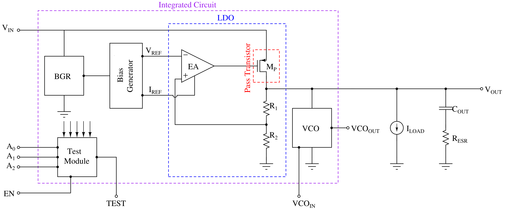

AutoMOS chip: LDO chip with integrated VCO
==========================================

This is our proposal for the Chipathon 2025. 

Please, check the details following this link [AutoMOS-project_Proposal](https://docs.google.com/presentation/d/1TvIR2NhGDkT4yeVhsB3TjcvvHDocXAfSwPzngiaAozw) or stored as PDF in this repository at [AutoMOS-project_Proposal.pdf](./AutoMOS-project_Proposal.pdf).
__________________________________________________________________

# Project information

## Goal (2 sentences): 

- We aim to build a basic power management chip (DC-DC converter) implementing a LDO as its core and including a VCO as an integrated load.

- Contribute to the glayout repository with the building blocks designer for the implementation.

## Design - High Level Proposal (2-3 sentences + Image and/or link to details)

- 1 Bandgap (1.2V) and  1 bias generator for current (PTAT, ZTC) and voltage (1V, 0.5V)

- 1 LDO (1.8V) with 0.2V of dropout 

- 1 VCO based on current-starved Ring Oscillator (1.8V) for 2.4GHz.

## Block diagram

## Application (1 sentence): 

This circuit is designed to provide regulated voltage rails for other system components, including MCUs, RF modules, ADCs, and others.

## References 

- https://www.seas.ucla.edu/brweb/papers/Journals/BR_SSCM_3_2021.pdf 

- https://www.ti.com/lit/an/slva118a/slva118a.pdf

- https://ieeexplore.ieee.org/document/7285037

- https://www.mdpi.com/1996-1073/13/11/2986
